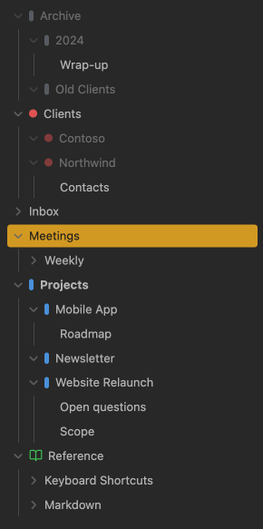
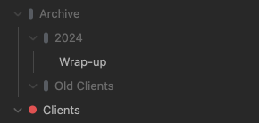
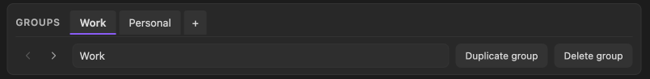
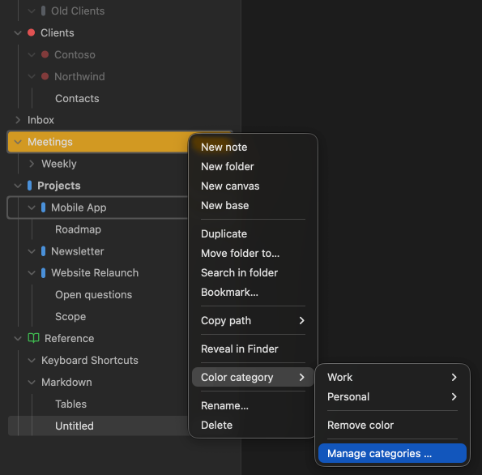
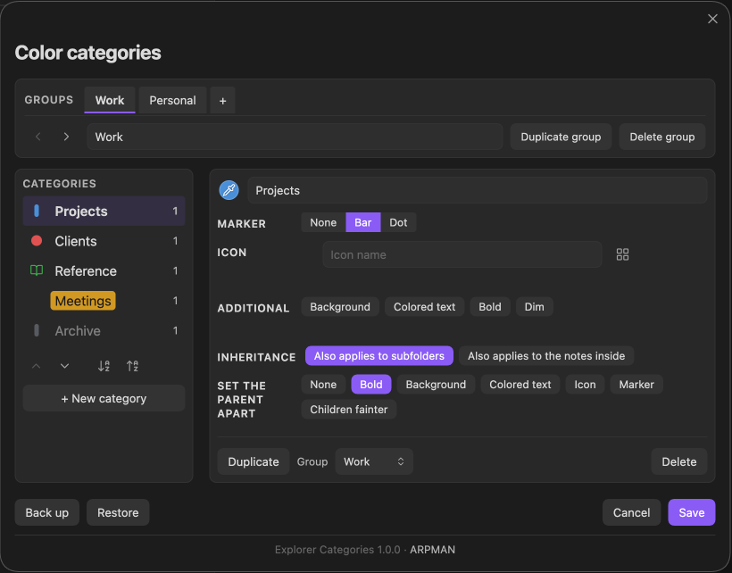
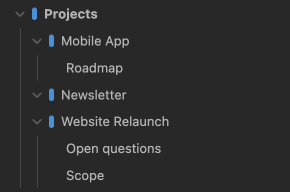

# Explorer Categories

Give a folder a category. The category carries the color, the marker and
the icon — and every folder in it looks the same. Change the category, and
all of them follow at once.

That is the whole idea. You are not painting folders one by one; you are
sorting them into groups that happen to be visible.

## What a category holds

A category is a name plus an appearance, and the appearance is complete:

- a color
- a marker in front of the name — a bar, a dot, or an icon
- an optional background, colored text, bold text
- or the opposite: dim, which makes the whole row step back

Each category carries its own. One can be a quiet gray bar, the next a
solid red background, a third just a bold blue name. You are not choosing
one style for the whole vault.

**Dim is there for the folders you are done with.** "Archive", "Finished",
"Old clients" — turning them louder is not what you want; turning them
quieter is. The whole row fades together, marker and icon included, so a
dot in full color cannot pull your eye back to the line that is meant to
step aside.

## One legend per part of the vault

The same color rarely means the same thing everywhere. Red is "software"
in one corner of a vault and "cardiologist" in another. So categories are
kept in **groups**, and a group is simply a legend: a set of categories
that belong together. It carries no color and no icon of its own.

Groups are tabs along the top of the management window — you see one
legend at a time instead of every category you have ever made. In the
context menu each legend becomes its own submenu.

Until you create a second one, none of this is visible. One legend means
one list and a flat menu, exactly as if groups did not exist.

## Working with it

**Assign a category.** Right-click a folder, pick a category. Done.

**Assign many at once.** Alt-click or shift-click several folders in the
file explorer, then right-click. The menu title tells you how many folders
you picked. Notes in the selection are skipped — a category is always
assigned to a folder, never to a single file.

**Let subfolders inherit.** Turn on "Also applies to subfolders" for a
category, and every folder in it passes its color down, including folders
you create later. A subfolder with a category of its own keeps it.

**Let the notes inherit too.** "Also applies to the notes inside" is a
second, separate switch. Turn it on and the notes below those folders
carry the color as well — canvases included. It reaches the whole subtree,
and a deeper folder with the same switch takes over from there.

It is deliberately not the same switch as the one above. Folding the two
together would have turned every folder that already inherits colorful in
one go, without anyone changing a setting.

Both switches sit in the management window, on the category — not on the
single folder. Everything a category decides is decided in one place.

**Manage categories.** Right-click any folder and choose "Manage
categories …", or run the command from the command palette. The window
lists your categories on the left and the settings of the selected one on
the right: color, name, marker, icon, the four extra switches and the two
inheritance switches. The list on the left is the preview: every row
shows its category exactly as the file explorer will, so you see all of
them at once rather than only the selected one.

**Icons come from Obsidian.** Any icon Obsidian ships with, searchable,
shown in the color of its category. An icon takes the place of the bar or
dot rather than adding to it.

**Renaming keeps the category.** Move a folder, rename it, rename a folder
above it — the assignment follows.

**Set the parent apart.** A folder that carries the category itself can
look different from the folders inheriting below it: bold, a background,
colored text, its own icon, its own marker, or the children a shade
fainter. Where a choice would have no effect — the category is bold
throughout anyway, or a background already decides the text color — the
button says so and is struck through instead of quietly doing nothing.

**Put the list in the order you want.** Two arrows below the list move the
selected category one place; two more sort the open group by name, A to Z
or back. The same pair of arrows sits next to the group tabs and moves the
whole group left or right. Sorting touches the open group only — the other
legends keep their places.

**Duplicate a category** to start a new one from an appearance that
already works, instead of setting seven things again.

**Move a category to another group** when a legend turns out to be the
wrong one. The folders keep their color.

## Nothing is written until you save

The window works on a draft. Change a color, rename, delete, restore a
backup — none of it reaches your vault until you press **Save**. **Cancel**
puts everything back the way it was, and closing the window counts as
cancelling.

**Back up your work.** "Backup" writes your categories, groups and folder
assignments to a readable JSON file: into your downloads folder on the
desktop, into `explorer-categories-backup/` inside the vault on a phone or
tablet, where no downloads folder worth the name exists. "Restore" reads
one back — through the system file dialog on the desktop, from a list of
what is in that folder on mobile.

A restore replaces everything at once, so it lands in the draft like any
other change: **Save** keeps it, **Cancel** drops it. The file is checked
before you are asked to confirm, so picking the wrong one costs a message,
not your colors.

## Privacy

**The plugin makes no network requests.** Nothing is sent anywhere, there
is no telemetry, no account and no paid tier. Your categories and folder
assignments live in `data.json` inside your vault, and that is the only
file the plugin reads or writes on its own.

**Two actions leave the vault, and only when you ask for them.** Pressing
"Backup" on the desktop hands the file to your browser as a download, the
way any web page does — it lands in your downloads folder. Pressing
"Restore" opens the system file dialog and reads the one file you pick.
The plugin has no access to your disk beyond those two dialogs; it uses no
Node.js or Electron APIs, which is why it runs on mobile as well.

## Interface language

The plugin follows the language set in Obsidian. English and German are
built in; every other language gets English.

To add one, copy `TEXTS_EN` in `main.js`, translate the entries, and add
the list to `LANGUAGES`. Nothing else changes. Pull requests welcome.

## Installing

Explorer Categories is not in Obsidian's community directory yet, so
there are two ways in for now.

**From a release.** Download `main.js`, `manifest.json` and `styles.css`
from the [latest release](https://github.com/jdaehler/explorer-categories/releases/latest)
into `<vault>/.obsidian/plugins/explorer-categories/`, then turn the
plugin on under Settings → Community plugins.

**With BRAT.** [BRAT](https://github.com/TfTHacker/obsidian42-brat), the
Beta Reviewers Auto-update Tool, is a community plugin that installs
other plugins straight from GitHub — before they reach the directory —
and keeps them up to date afterwards. Install BRAT, then hand it this
repository: `jdaehler/explorer-categories`.

## How it works

The plugin never touches the file explorer. It writes a single `<style>`
element into the document head and lets Obsidian do the drawing — no
MutationObserver, nothing running in the background, nothing to slow the
explorer down. Rules of the same kind are merged, so a vault with several
hundred colored folders still produces a short stylesheet.

## Requirements

Obsidian 1.12.0 or newer. Works on desktop and mobile.

## Credits

This is an independent plugin, not a fork: it shares no code with any
other project. What it does borrow is an idea — generating CSS rules
instead of manipulating the DOM — from [Color Folders and
Files](https://github.com/Mithadon/obsidian-color-folders-files) by
Mithadon (MIT), which is worth a look if you want colors on single files
rather than categories on folders.

## License

MIT — see [LICENSE](LICENSE).

Author: ARPMAN
Built with AI assistance.
